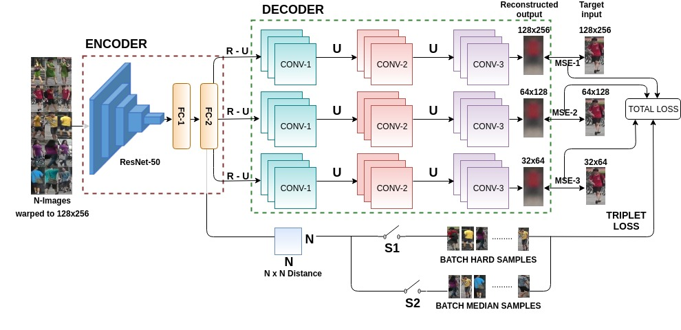

# HDRNet
This project aims at re-identify person using deep reconstruction network. It is based on our IEEE-ACCESS 2019 paper Hdrnet: 
The code is modified from the [triplet re-id](https://github.com/VisualComputingInstitute/triplet-reid) given by Visual Computing Lab.

# Architecture



# Installation
See Installation of [TensorFlow](https://www.tensorflow.org/) \
Tensorboard is also recommended for visualization.
- **This repository requires at least version 1.4 of TensorFlow.**
- **The TensorFlow code is Python 3 only and won't work in Python 2!**
- **Port Forwarding can be required to use tensorboard**

# Pre-processing

Please prepare the dataset as per instruction of [triplet re-id](https://github.com/VisualComputingInstitute/triplet-reid)

# Training
```
python train_exp3dec.py \
          --train_set "dataset_path in csv format" \
          --image_root "dataset_path" \
          --experiment_root "log_path" \
          --initial_checkpoint init/resnet_v1_50.ckpt \
          --batch_p batch_size --margin 0.5 --flip_augment --crop_augment
```
# Feature Extraction
```
python feature.py \
--experiment_root "log_path" \
--dataset "dataset_path in csv format" \
--filename test_embeddings.h5 \
--flip_augment --crop_augment five --aggregator normalized_mean
```

# Evaluation
Use evaluate.py to compute cmc and mAP

# Reconstruction
Use embeddings.h5 file and give as an input to Reconstruction/.ipynb file to reconstruct the images.


# Citation
If you use any of the provided code, please cite:
```
@article{kansal2019hdrnet,
  title={Hdrnet: Person Re-Identification Using Hybrid Sampling in Deep Reconstruction Network},
  author={Kansal, Kajal and Subramanyam, AV},
  journal={IEEE Access},
  volume={7},
  pages={40856--40865},
  year={2019},
  publisher={IEEE}
}
```
